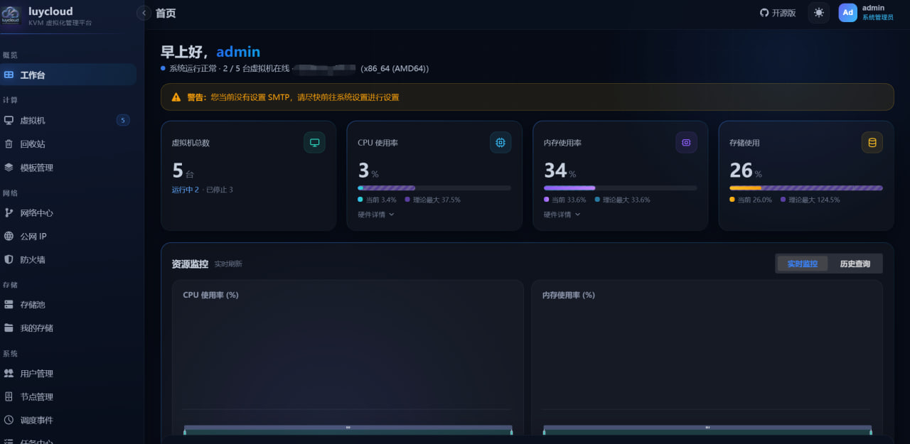

<div align="center">



# ☁️ luycloud

**開源 · 輕量 · 一體化的 KVM 虛擬機管理控制台**

基於 KVM/QEMU 深度整合，涵蓋虛擬機生命週期、網路與儲存編排、快照複製、防火牆與頻寬治理的私有雲平台。

<br/>

[](LICENSE)
[](https://github.com/luolu1/luycloud)
[](https://github.com/luolu1/luycloud)
[](https://github.com/luolu1/luycloud/issues)
[](https://github.com/luolu1/luycloud/pulls)

<br/>

[English](README.md) · [简体中文](README.zh-CN.md) · 繁體中文 · [日本語](README.ja.md)

[**🚀 快速部署**](#-快速部署) · [**✨ 核心功能**](#-核心功能) · [**🧰 技術棧**](#-技術棧) · [**🤝 貢獻指南**](#-開發貢獻指南) · [**💬 問題回報**](https://github.com/luolu1/luycloud/issues)

</div>

---

## 📖 專案簡介

luycloud 是一個面向小型企業和個人私有雲服務場景的開源虛擬機管理平台，基於 KVM/QEMU 虛擬化技術深度整合，提供從虛擬機生命週期管理、網路與儲存編排、快照與複製、防火牆與頻寬治理，到 Web 控制台與 API 一體化交付的完整解決方案。

> 💡 luycloud 基於 QVMConsole 二次開發，移除了原版的部分限制，採用獨立的品牌與部署方案，便於自由擴充與私有化部署。

### 核心價值

| | 價值點 | 說明 |
|:---:|:---|:---|
| 🎯 | **降低維運門檻** | 提供「即開即用」的虛擬化管理平台，減少重複造輪子的成本 |
| ⚡ | **範本即點即用** | 預製 Linux/Windows/OpenWrt 等常用系統範本，不需了解 KVM 底層指令，只需填寫幾個表單欄位即可在數分鐘內完成虛擬機建立；系統會自動處理磁碟格式、開機類型、網路設定等複雜細節 |
| 🧩 | **模組化設計** | 可插拔網路後端（如 Open vSwitch），適配多樣化的網路拓撲與安全策略 |
| 🔀 | **雙入口架構** | Web 控制台與 RESTful API 兼顧自動化與人工維運效率 |
| 📊 | **可觀測性** | 任務佇列與 SSE 機制實現長時間操作的可觀測與可中斷，保障大規模並行下的穩定性 |

---

## 🚀 快速部署

luycloud 提供一鍵安裝腳本，自動完成相依套件安裝（libvirt / qemu-kvm / Open vSwitch 等）、使用者儲存、systemd 服務註冊與啟動。

### 方式一：一鍵遠端部署（推薦）

無需手動下載原始碼，腳本會自動複製最新原始碼、準備 Go/Node 工具鏈、本機編譯並進入互動式安裝：

```bash
# 以 root 執行（二選一）
bash <(curl -fsSL https://raw.githubusercontent.com/luolu1/luycloud/main/luycloud-deploy.sh)
bash <(wget -qO- https://raw.githubusercontent.com/luolu1/luycloud/main/luycloud-deploy.sh)
```

引導腳本會依序執行：CPU 架構檢測 → 檢測/自動安裝 git、Go、Node.js 工具鏈 → 複製或更新 `main` 分支原始碼 → `build.sh` 本機編譯前端 + 後端 → 呼叫 `install.sh` 完成互動式安裝。已安裝時腳本會自動切換為「更新 / 解除安裝」選單。

- 🌐 存取位址：`http://<服务器IP>:8080`
- 🔑 預設帳號：`admin` / `admin123`（首次登入請立即修改）

> 📌 直接複製原始碼編譯，始終與儲存庫 `main` 分支保持即時同步。可用環境變數覆寫行為：`LUYCLOUD_GIT`（儲存庫位址）、`LUYCLOUD_BRANCH`（分支）、`LUYCLOUD_SRC`（原始碼檢出目錄，預設 `/opt/luycloud-src`）、`LUYCLOUD_VARIANT`（`native` 原生版 / `compat` zig 相容版，預設 `native`）、`GOPROXY`（中國加速）、`LUYCLOUD_MIRROR`（GitHub CDN 代理前綴，如 `https://ghfast.top`）。

### ⚡ 一鍵更新（已安裝使用者推薦）

已安裝使用者升級到新版本（例如新增「回收站」功能）時，無需重新編譯，直接拉取 GitHub Releases 的**預編譯發行包**熱替換二進位檔與前端並重新啟動服務：

```bash
# 以 root 執行（二選一）
bash <(curl -fsSL https://raw.githubusercontent.com/luolu1/luycloud/main/update.sh)
bash <(wget -qO- https://raw.githubusercontent.com/luolu1/luycloud/main/update.sh)
```

- 🚀 秒級更新，無需 Go / Node 工具鏈；自動依 GLIBC / AVX2 選擇原生版或相容版二進位檔
- 🛡️ 更新前自動備份舊版本，新版啟動失敗時會自動回滾
- 🌏 **CDN 加速**：中國境內存取 GitHub 較慢時，腳本提供內建代理鏡像選單，也可使用環境變數指定：

  ```bash
   # 使用 CDN 代理前綴加速下載
  LUYCLOUD_MIRROR="https://ghfast.top" bash <(curl -fsSL https://raw.githubusercontent.com/luolu1/luycloud/main/update.sh)

   # 更新到指定版本（預設 latest）
  LUYCLOUD_RELEASE_TAG="v1.1.0" bash update.sh
  ```

> 💡 `update.sh` 僅用於**更新**現有安裝；首次安裝請使用上方的 `luycloud-deploy.sh`。`luycloud-deploy.sh` 同樣支援 `LUYCLOUD_MIRROR` 代理前綴以加速 `git clone`。

<details>
<summary><b>方式二：使用發行包一鍵部署</b></summary>

<br/>

若已有建置好的發行包：

```bash
# 1. 下載並解壓發行包（amd64 / arm64）
tar -xzf luycloud-linux-amd64.tar.gz
cd luycloud-linux-amd64

# 2. 以 root 執行一鍵安裝腳本
sudo bash install.sh
```

腳本會依序執行：硬體虛擬化檢測 → 相依套件安裝 → 使用者儲存初始化 → 網路基礎（OVS/DHCP/轉送）→ systemd 服務註冊 → 啟動服務。安裝完成後終端機會列出存取位址。

> 安裝腳本為互動式，可依提示選擇儲存磁碟、容量、Web 連接埠、是否開啟公網存取，以及是否執行相容性實機測試。

</details>

<details>
<summary><b>方式三：從原始碼手動建置</b></summary>

<br/>

需要 Go 1.27+ 與 Node.js 22+（Vite 8 / rolldown 要求 Node ≥ 20.19）。

```bash
# 建置前端 + 後端並產生發行包
bash build.sh --variant native      # 使用主機原生編譯
# 或
bash build.sh                       # 同時建置 zig 相容版（需要安裝 zig）

# 產物位於 release/luycloud-linux-<arch>.tar.gz
# 解壓後執行 sudo bash install.sh 即可部署
```

中國境內網路建置提示：Go 相依套件可設定 `GOPROXY=https://goproxy.cn,direct`；前端相依套件需要 Node ≥ 20.19 才能正確安裝 rolldown 原生繫結。

</details>

### 開發模式

```bash
bash start-dev.sh
# 後端 air 熱重載 (:8080)，前端 vite (:5173)
```

### 常用維運指令

```bash
systemctl status kvm-console      # 查看服務狀態
journalctl -u kvm-console -f      # 查看即時記錄
systemctl restart kvm-console     # 重新啟動服務
sudo bash qvmc-manage.sh          # 帳戶與安全管理（重設密碼、清除 2FA、變更連接埠、公網開關等）
```

<details>
<summary><b>⚙️ 巢狀虛擬化環境部署說明</b></summary>

<br/>

當主機本身執行於虛擬機中（巢狀 KVM）時，`host-passthrough` 會讓 QEMU 嘗試設定 `MSR 0x345 (IA32_PERF_CAPABILITIES)` 而崩潰：

```
qemu-system-x86_64: error: failed to set MSR 0x345 to 0x2000
kvm_buf_set_msrs: Assertion `ret == cpu->kvm_msr_buf->nmsrs' failed.
```

luycloud 在偵測到主機處於巢狀虛擬化環境（`/proc/cpuinfo` 含有 `hypervisor` 標誌）時，會自動向虛擬機 domain XML 注入 `<pmu state='off'/>` 關閉 vPMU 以避免崩潰；此變更在裸機主機上不會產生作用，不影響正常的效能計數器功能。

</details>

---

## ✨ 核心功能

<table>
<tr>
<td width="50%" valign="top">

### 🖥️ 虛擬機生命週期管理
- 完整的電源操作（開機/關機/重新啟動/強制斷電/重設）
- 配額控制與權限驗證
- 維護模式與正常關機

### 🌐 網路虛擬化
- VPC 邏輯交換器與安全群組
- 連接埠轉送與靜態 IP 管理
- 防火牆策略（VM/主機雙層）
- 網路診斷與封包擷取工具

### 💾 儲存管理
- 主機儲存池管理（格式化/分割區/LVM 磁碟區）
- 範本管理（製作/匯入/匯出/刪除）
- 磁碟管理與 IOPS 限制
- 使用者 ISO 掛載

</td>
<td width="50%" valign="top">

### 👥 使用者權限與配額
- 多租戶支援（彈性雲/輕量雲）
- 細緻配額管理（CPU/記憶體/磁碟/VM 數量/儲存/頻寬/流量/公網 IP/連接埠轉送/快照）
- SSH 存取控制與邀請註冊流程

### 📈 監控與任務排程
- VM/主機統計與歷史資料
- 非同步任務佇列與 SSE 即時推送
- 定時事件中心與資源回收

### 📸 快照備份
- 建立/還原/刪除/批次刪除快照
- NVRAM 與共用目錄相容性檢查
- 配額驗證與任務追蹤

</td>
</tr>
</table>

<details>
<summary><b>🧬 透過範本建立虛擬機（點擊展開詳細資訊）</b></summary>

<br/>

- **範本管理**：支援從執行中的虛擬機一鍵製作範本、匯入/匯出範本包（tar.gz）、預覽匯入完整性驗證
- **多類型範本支援**：Linux（cloud-init）、Windows（ConfigDrive）、OpenWrt（UCI 設定注入）、FnOS（virt-customize）及「不初始化」模式
- **統一複製架構**：支援完整複製與鏈式複製兩種模式，完整複製會產生獨立磁碟映像，鏈式複製基於 backing chain 實現快速部署
- **系統初始化控制**：可停用系統初始化，保留範本原始系統設定；支援阻塞式/非阻塞式啟動後指令執行
- **智慧開機偵測**：自動偵測 UEFI/BIOS 開機類型、複製 NVRAM 路徑，確保跨架構相容性
- **OpenWrt 雙模式初始化**：自動偵測 ext4 根分割區和 squashfs+overlay 兩種磁碟配置，智慧選擇 virt-customize 或 guestfish 注入網路設定
- **Windows ConfigDrive**：符合 OpenStack 標準的 ISO 映像，透過 cloudbase-init 自動完成主機名稱、密碼等初始化設定
- **中繼資料驅動**：範本類型、分類、預設硬體設定、雜湊驗證、範本族群關係等均由 `.meta.json` 中繼資料檔案管理
- **版本與完整性驗證**：MD5 + SHA256 雙重雜湊驗證，確保範本磁碟完整性
- **範本族群管理**：支援範本父子關係、節點樹、級聯刪除、靜默提升與熱提升操作

</details>

---

## 🧰 技术栈

<table>
<tr>
<td valign="top" width="50%">

**後端**

| 元件 | 選型 |
|:---|:---|
| 語言 | Go 1.27+ |
| Web 框架 | Gin v1.12.0 |
| 資料庫 | SQLite + GORM v1.31.1 |
| 虛擬化 | go-libvirt RPC |
| 驗證 | JWT v5.3.1 + TOTP v1.5.0 + crypto |
| WebSocket | gorilla/websocket v1.5.3 |
| 記錄 | lumberjack v2.2.1 |

</td>
<td valign="top" width="50%">

**前端**

| 元件 | 選型 |
|:---|:---|
| UI 框架 | React v19.2.7 + TypeScript v6.0.2 |
| 元件庫 | Semi Design v2.101.1 |
| 建置工具 | Vite v8.1.1 |
| 路由 | react-router-dom v7.18.1 |
| 狀態管理 | Zustand v5.0.14 |
| HTTP 用戶端 | Axios v1.18.1 |
| 圖表 / 終端機 / VNC | ECharts v6.1.0 · @xterm/xterm v6.0.0 · @novnc/novnc v1.7.0 |

</td>
</tr>
</table>

> 舊版前端（備份）：Vue 3.5.30 + Element Plus，位於 `web-backup/`。

**虛擬化基礎設施**：KVM/QEMU · Open vSwitch · Windows 初始化（ConfigDrive 標準支援）

---

## 📋 系統需求

<table>
<tr>
<td valign="top" width="50%">

**硬體需求**

- ✅ 支援 VT-x/AMD-V 的 CPU
- 🧠 至少 4GB RAM（建議 8GB+）
- 💽 至少 50GB 可用磁碟空間

</td>
<td valign="top" width="50%">

**軟體需求**

- 🐧 作業系統：Debian/Ubuntu（建議 Debian 12+）
- 🖧 虛擬化：KVM/QEMU
- 🌉 網路：Open vSwitch
- 🛠️ 相依工具：genisoimage（用於 Windows 虛擬機初始化）

</td>
</tr>
</table>

---

## 🤝 開發貢獻指南

作為一個由獨立開發者維護的大型開源專案，luycloud 需要社群貢獻者的支援才能持續完善。我們歡迎並鼓勵您使用 AI 等工具進行功能修復與開發，但請務必遵守以下準則：

1. **遵守規則**：使用 AI 工具時，必須將根目錄的 `AGENTS.md` 檔案作為核心提示詞規則
2. **場景通用性**：提交的功能應面向通用使用場景，符合廣大使用者的需求。針對特定場景的客製功能，建議自行 fork 儲存庫維護

### 🔒 安全漏洞回報

如果您發現專案存在安全漏洞，無論嚴重程度如何，請勿在 GitHub Issues 中公開回報，以避免安全風險遭到惡意利用。請透過儲存庫私有管道聯絡維護者進行安全揭露：[提交私密安全回報](https://github.com/luolu1/luycloud/security)。

---

## 🔄 合併上游修改

當標準儲存庫後端有修改時，請參閱 [`docs/merge-from-upstream.md`](docs/merge-from-upstream.md) 取得詳細合併指南。

**核心原則：**

1. 只合併 `server/` 目錄的後端修改
2. 拒絕合併 `web/` 目錄的任何前端修改
3. 本儲存庫 `web-backup/`、`.gitignore`、`docs/` 中的獨有內容不會被上游覆寫

---

## 💖 致謝

感謝所有為 luycloud 做出貢獻的開發者！

特別感謝由 [**ForZTN**](https://sponsorship.forztn.com/github.com/luolu1/luycloud) 贊助測試機器

---

<div align="center">

**☁️ luycloud** — 讓虛擬化管理更簡單

[官方網站](https://github.com/luolu1/luycloud) · [文件網站](https://github.com/luolu1/luycloud) · [部署指南](https://github.com/luolu1/luycloud)

<sub>如果這個專案對您有幫助，歡迎點一個 ⭐ Star 支援！</sub>

</div>
